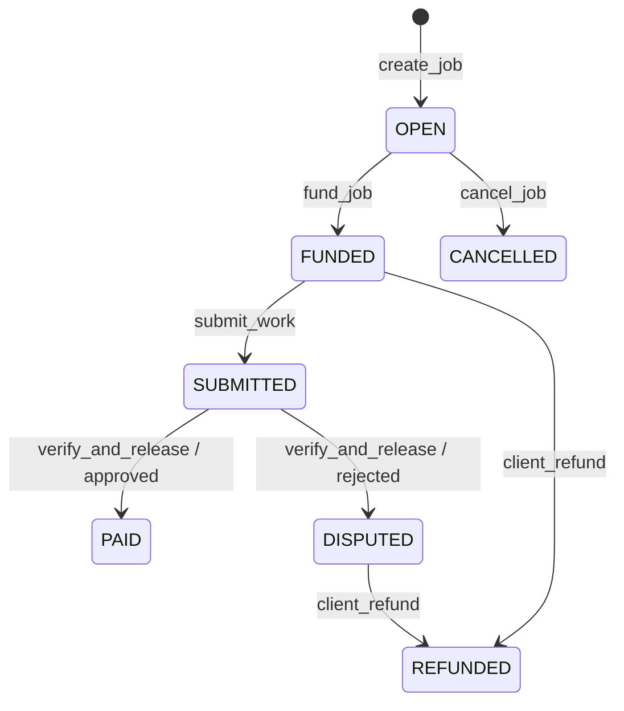

# FreelanceMarket

[](https://github.com/Manablaq/freelance-escrow/actions/workflows/ci.yml)


FreelanceMarket is an on-chain freelance escrow application on GenLayer Bradbury for wallet profiles, funded jobs, public deliverables, and AI-assisted deliverable verification.

[Open the live application](https://genmarket-escrow.vercel.app) · [View the deployed contract](https://explorer-bradbury.genlayer.com/address/0x75af88bfA0592CFA63c06f2F68BfD35C13dDd4EF)

> **Testnet warning:** FreelanceMarket runs only on GenLayer Bradbury Testnet. It is not a mainnet product, legal arbitration service, guarantee of fair outcomes, or risk-free custody system. Testnet GEN has no implied mainnet value.

## Features

- One on-chain `client` or `freelancer` profile per wallet, with profile updates that preserve the original role.
- Public freelancer marketplace, public profile pages, role-aware dashboards, and direct job assignment.
- Contract-held GEN funding with explicit `OPEN`, `FUNDED`, `SUBMITTED`, `PAID`, `DISPUTED`, `REFUNDED`, and `CANCELLED` states.
- Public deliverable URLs evaluated through GenLayer's nondeterministic web and prompt facilities.
- Structured receipt classification that separates successful execution from acceptance alone.
- Expected accepted-state polling, existing-hash retry, scope cancellation, and automatic dependent-data refresh without a browser reload.
- Allowlisted frontend writes and an allowlisted, argument-validated server read route fixed to the configured deployment.

## Workflows

### Client

1. Register the wallet as a client.
2. Select a registered freelancer and create a job.
3. Fund the `OPEN` job by attaching GEN to `fund_job`.
4. Review the freelancer's public deliverable after submission.
5. Initiate `verify_and_release`; this action is never triggered automatically by the frontend.
6. After successful structured execution, wait for the expected accepted contract state. An approved result produces `PAID`; a rejected result produces `DISPUTED`.
7. Use `client_refund` for a `FUNDED` or `DISPUTED` job, or `cancel_job` for an unfunded `OPEN` job when appropriate.

### Freelancer

1. Register the wallet as a freelancer and maintain its public profile.
2. Receive jobs assigned by registered clients.
3. After a client funds a job, submit one publicly accessible HTTP(S) deliverable URL.
4. Track the client-initiated verification result and accepted job state from the dashboard or job page.

## Job lifecycle



Only the assigned client can fund, verify, refund, or cancel within the contract's status rules. Only the assigned freelancer can submit work. There are no admin methods or admin powers.

## AI-assisted deliverable verification

The client initiates `verify_and_release`. Validators receive explicit serialized job context, fetch bounded content from the public deliverable URL, treat webpage instructions as untrusted, and semantically compare the evidence with the requested work. The evaluator returns a bounded structured approval value, score, reason, and evidence summary; malformed, inaccessible, empty, or insufficient evidence fails closed.

The semantic-consensus review fix requires validator agreement on the settlement-relevant approval value, valid 0–100 scores within ten points, and a score of at least 70 for approval. Reasons and summaries may differ. The closure-serialization review fix moves nondeterministic evaluation to a module-level helper and binds only an explicit serialized JSON context, rather than closing over contract storage, `self`, or a method-local job record.

AI-assisted verification is probabilistic validator judgment over public evidence. It is not objective truth, legal arbitration, or a guarantee of fairness. URL availability, prompt/provider behavior, validator consensus, job specificity, and evidence quality remain trust assumptions.

## Deployed-source verification

**The deployed Bradbury contract at `0x75af88bfA0592CFA63c06f2F68BfD35C13dDd4EF` matches `contracts/freelance_market.py`.**

- Verified source SHA-256: `941104a3374f893c51a60281cdb942272b09bbe433e970e4f86baf3f4b73a08f`
- Deployment transaction: `0x27a83352d39feda126c0d122a3e3223c238708c99f75bfddbb3bf280283902b1`
- Professional frontend baseline commit: `880bce5`
- Network: GenLayer Bradbury Testnet, chain ID `4221`
- RPC: `https://rpc-bradbury.genlayer.com`

See [Deployment reference](docs/DEPLOYMENT.md), [Hosted Studio full-flow evidence](docs/HOSTED_STUDIO_FULL_TEST_EVIDENCE.md), and the newer [Bradbury supported-runtime evidence](docs/BRADBURY_SUPPORTED_RUNTIME_EVIDENCE_2026-07-20.md) for the separately deployed exact-source reviewer flow.

## Transaction synchronization

Writes use an optimistic, non-blocking lifecycle. The page owns preparation and
wallet signing only. As soon as a hash exists, a versioned serializable pending
record is stored, the conflicting action is disabled, and the app remains
navigable. A global provider continues receipt checks across route changes and
refreshes with exponential backoff from 2 seconds to a 10-second maximum.

Pending records use `freelance-market:pending-transactions:v1` with the shape
`{ version: 1, transactions: [...] }`. Every entry includes chain ID, deployed
contract, and wallet. Other-wallet entries remain persisted but paused.

Acceptance is not success: processing/timeouts stay pending,
`FINISHED_WITH_ERROR` fails even with `ACCEPTED`, and only
`FINISHED_WITH_RETURN` advances to a method-specific expected-state read.
Registration shows the submitted form as Pending with its hash and explorer
link until the profile read proves the role and existence.

```text
Wallet request
→ transaction hash
→ structured receipt processing
→ successful execution result
→ expected accepted-state confirmation
→ dependent data refresh
→ confirmed UI state
```

The frontend requires an `ACCEPTED` or `FINALIZED` structured receipt together with `FINISHED_WITH_RETURN` before it starts action-specific state confirmation. Acceptance paired with `FINISHED_WITH_ERROR` is an execution failure, not success. Processing, unknown receipt, canceled, undetermined, execution-error, and accepted-state synchronization-timeout states remain distinct.

Confirmation reads accepted contract state and checks the exact expected transition. Scope versioning and `AbortSignal` propagation stop stale wallet/page requests from updating a new scope. Retrying a pending or unknown transaction checks the existing hash and does not resubmit the wallet write. A global refresh event and deduplicated page polling then update affected profile, job, and statistics views without requiring a manual browser reload.

See [Transaction and accepted-state lifecycle](docs/TRANSACTION_LIFECYCLE.md).

## Architecture

The frontend uses the Next.js App Router. Interactive pages submit allowlisted writes client-side with the connected wallet. `app/api/contract/route.ts` performs read-only Bradbury calls with no account, accepts only six known view methods, validates method-specific address/job arguments, targets the configured contract, requests accepted state, disables caching, and exposes no arbitrary contract call surface.

See [Architecture](docs/ARCHITECTURE.md) for routes, roles, allowlists, state transitions, cancellation, polling, and refresh behavior.

### Technology stack

- Next.js 16.2 and React 19
- TypeScript 5
- `genlayer-js` 1.1
- wagmi 3, viem 2, RainbowKit 2, and TanStack Query 5
- GenLayer intelligent contract in Python
- ESLint 9 and Node's built-in test runner
- Python `unittest`, with optional environment-dependent Direct Mode diagnostics

### Repository structure

```text
app/          App Router pages and the allowlisted contract-read Route Handler
components/   Shared shell, navigation, transaction, modal, and status UI
hooks/        Polling and transaction/accepted-state synchronization
lib/          Deployment config, GenLayer client, receipts, retry, and scope guards
contracts/    FreelanceMarket intelligent contract source
scripts/      Read-only deployment inspection and explicitly invoked smoke tooling
tests/        Node and Python offline/review suites plus Direct Mode diagnostics
docs/         Architecture, lifecycle, deployment, QA, diagnostics, and smoke evidence
```

## Local development

### Requirements

- Node.js 24.x (CI also uses Node 24)
- npm
- Python 3 for the standard Python suite
- A browser wallet configured for Bradbury only when manually exercising wallet flows

With `nvm`, run `nvm use` from the repository root to select the Node.js version declared in `.nvmrc`.

Node.js 24 is required because the Node test suites execute erasable TypeScript source directly through Node's native type stripping.

### Installation

```bash
git clone https://github.com/Manablaq/freelance-escrow.git
cd freelance-escrow
npm ci
npm run dev
```

Use the local URL printed by Next.js. Local development does not require private keys in repository files.

### Environment configuration

The application uses these public build-time variables:

```bash
NEXT_PUBLIC_FREELANCE_MARKET_ADDRESS=0x75af88bfA0592CFA63c06f2F68BfD35C13dDd4EF
NEXT_PUBLIC_WALLETCONNECT_PROJECT_ID=your_project_id_from_walletconnect_cloud
```

The WalletConnect value above is an example label, not a literal valid project ID; replace it with the real value from WalletConnect Cloud. `NEXT_PUBLIC_FREELANCE_MARKET_ADDRESS` is optional: if omitted, `lib/config.ts` uses the same verified address. `NEXT_PUBLIC_WALLETCONNECT_PROJECT_ID` is required to enable WalletConnect-based connectors. Vercel must receive it for both preview and production deployments.

Both variables are browser-visible and fixed at build time; neither is a private secret. If the WalletConnect value is absent, the application deliberately configures only an injected browser-wallet connector so local and CI builds remain usable without a fake project ID. WalletConnect production reliability is not verified until a real value is configured in Vercel and tested.

Never store private keys, seed phrases, wallet credentials, Vercel tokens, GitHub tokens, or API secrets in `.env.example` or tracked files.

## npm scripts

| Command | Purpose |
| --- | --- |
| `npm run dev` | Start the local Next.js development server |
| `npm run build` | Create a production Next.js build |
| `npm run start` | Serve an existing production build |
| `npm run lint` | Run ESLint |
| `npm run test:node` | Run all `tests/*.test.mjs` suites |
| `npm run test:python` | Discover and run Python `unittest` suites |
| `npm test` | Run Node and Python suites |
| `npm run check:frontend` | Run lint and production build |
| `npm run check` | Run lint, build, Node tests, and Python tests |
| `npm run inspect:deployment` | Read deployment receipt and accepted contract state |
| `npm run smoke:approval` | Run the write-capable, resumable approval smoke tool |
| `npm run smoke:rejection` | Run the write-capable, resumable rejection smoke tool |

The smoke commands can load wallet keys and write to Bradbury. They require the exact `SMOKE_LIVE_BRADBURY=I_UNDERSTAND_THIS_WRITES_TO_BRADBURY` opt-in plus explicit supported-runtime configuration, and are intentionally excluded from `npm test`, `npm run check`, and standard CI. Each invocation canonicalizes the journal parent and acquires a mode-`0600` lock file for that exact journal using exclusive creation and no-follow where supported before journal, key, or client access. It keeps the descriptor open through polling and final persistence and checks the parent and lock device/inode plus its ownership token before release. A crash-left lock is never expired automatically and requires manual investigation and removal. Before any verification write or retry, the runner requires a complete pre-verification snapshot whose freshness starts before the first snapshot read and is at most ten minutes old. Nonce, gas, gas-price, calldata, and signing preparation finish first; freshness is then rechecked synchronously after signing and immediately before starting `eth_sendRawTransaction`, with no asynchronous gap. Stale snapshots fail closed without refreshing the persisted snapshot and require manual investigation or a new controlled run.

The runner does not intercept or replace process-global `console.error`, `console.warn`, or `console.log`. Risky asynchronous GenLayer operations use a runner-owned, injected-fetch Bradbury JSON-RPC adapter for contract views, balances, transaction state, debug-trace classification, and signed transaction submission. HTTP success, requests, JSON-RPC envelopes, method results, decoded contract views, receipts, logs, and projected transaction evidence use closed schemas; transport, RPC, decoding, signing, trace, and malformed-response failures become fixed secret-safe categories. Transaction polling reproduces pinned `genlayer-js@1.1.8`: concurrent `getTransactionData(hash, currentUnixSeconds)` and `getTransactionAllData(hash)` reads, with status/result from the former and execution result from the latter, followed by additional cross-source identity and request binding. On writes, the local keccak256 hash of the signed legacy transaction must equal both the RPC-returned EVM hash and receipt transaction hash; receipt signer and destination must match, and exactly one recognized `NewTransaction` or `CreatedTransaction` event from the pinned consensus contract supplies the canonical GenLayer ID used for polling. Logs with unknown topic signatures are ignored as unrelated, while any recognized creation-topic log is validated strictly and zero or multiple recognized creation events fail. This does not claim suppression of arbitrary direct stdout or stderr writes by unknown external code. Do not run the smoke commands without explicit authorization and controlled testnet credentials.

A completed journal contains only closed metadata and references a same-directory, deterministic-basename evaluator sidecar containing the exact canonical `eqBlocksOutputs` bytes. The sidecar is a regular mode-`0600` file, is opened without following symlinks, and is never printed, placed in errors or lock metadata, or copied into documentation. Before a completed journal is accepted, the runner verifies the sidecar length and SHA-256, re-runs the production structural decoder, and recomputes the transaction binding, selector, output digest, approval, score, and reason/evidence-summary presence, byte lengths, and hashes. Raw validator prose never enters the journal or ordinary runner output.

Journal and sidecar replacement uses a mode-`0600` durable transaction record with controlled basenames, hashes, and state only. New files are fsynced, prior files are retained under transaction-owned rollback names, and the helper reports `PREPARED_AFTER_RENAME`; the parent verifies the helper, lock, directory, and transaction identities before sending the exact commit acknowledgment. A helper death before the durable commit marker causes rollback under the still-held invocation lock before save failure is returned. A death after the helper has durably recorded the acknowledged commit deterministically rolls forward that one committed pair. Incomplete transaction records are recovered before journal use on a later locked invocation. These claims are limited to the tested protocol and do not imply broader filesystem or hardware guarantees.

### Bradbury supported-runtime reproduction

This workflow is Bradbury-only, writes real testnet transactions, and must be run from the repository root so the journal paths are exactly `.smoke-freelance-market.approval.json` and `.smoke-freelance-market.rejection.json`.

```bash
npm ci
export SMOKE_LIVE_BRADBURY=I_UNDERSTAND_THIS_WRITES_TO_BRADBURY
export SMOKE_BRADBURY_CHAIN_ID=4221
export SMOKE_BRADBURY_CONTRACT_ADDRESS=0x066131dffbE72e27AB40446620792d45a9a6054a
export SMOKE_BRADBURY_CLIENT_ADDRESS=0x5bB49021001200fE8156a81c7fcF097e535e7181
export SMOKE_BRADBURY_FREELANCER_ADDRESS=0x1f87Ae197af539253978d435aD45cCf28Fb95024
export SMOKE_BRADBURY_CLIENT_PRIVATE_KEY=0xREPLACE_WITH_AUTHORIZED_CLIENT_PRIVATE_KEY
export SMOKE_BRADBURY_FREELANCER_PRIVATE_KEY=0xREPLACE_WITH_AUTHORIZED_FREELANCER_PRIVATE_KEY
export SMOKE_ESCROW_WEI=1000000000000000000
export SMOKE_APPROVAL_DELIVERABLE_URL=https://raw.githubusercontent.com/Manablaq/freelance-escrow/4ffa69be4ed4f5a8122fb57d3d93f29a6056b125/docs/smoke/approval-deliverable.md
export SMOKE_REJECTION_DELIVERABLE_URL=https://raw.githubusercontent.com/Manablaq/freelance-escrow/4ffa69be4ed4f5a8122fb57d3d93f29a6056b125/docs/smoke/rejection-deliverable.txt
```

The keys must derive exactly to the configured addresses. The client key must control the registered client and have at least the exact 1 GEN escrow plus Bradbury transaction fees; the freelancer key must control the assigned registered freelancer and have enough GEN for registration/submission fees. Never store real keys in tracked files.

The current approval command uses base title `Document GenLayer escrow verification` and base description `Provide a public page that clearly and specifically documents this GenLayer freelance escrow verification workflow and its approval behavior.` The current rejection command uses base title `Summarize GenLayer escrow requirements` and base description `Provide a public page that clearly and specifically summarizes this GenLayer freelance escrow contract and its semantic verification requirements.` A unique `[smoke:<run-id>]` marker is prepended/appended. Run one authorized flow at a time:

```bash
npm run smoke:approval
npm run smoke:rejection
```

Expected transitions are `OPEN` → `FUNDED` with exactly `1000000000000000000` wei → `SUBMITTED`, then `PAID`/`APPROVED` for approval or `DISPUTED`/`REJECTED` for rejection. `ACCEPTED` is only an intermediate execution receipt. Terminal evidence begins only after the exact verification transaction reaches `FINALIZED`, status code `7`, `AGREE` or `MAJORITY_AGREE`, `FINISHED_WITH_RETURN`, and a non-null structurally decoded comparative output. Approval then requires a 1 GEN increase in `total_paid`, `total_earned`, `jobs_completed +1`, zero escrow, and a 1 GEN finalized freelancer-balance delta. Rejection requires unchanged counters and freelancer balance with the full 1 GEN still escrowed.

Re-running the same command safely resumes its matching journal and never automatically rebroadcasts an ambiguous intent. If a write may have been broadcast but no GenLayer ID was durably recorded, stop and investigate RPC/explorer state; do not guess a hash. A verification retry is permitted only after the journaled prior verification ID is independently proven to be an exact terminal failure and the job remains the same funded `SUBMITTED` job with fresh baseline evidence. The exact retry is:

```bash
SMOKE_RETRY_VERIFY_FROM_HASH=0xEXACT_PROVEN_TERMINAL_FAILURE_GENLAYER_ID npm run smoke:approval
# or, for the rejection journal:
SMOKE_RETRY_VERIFY_FROM_HASH=0xEXACT_PROVEN_TERMINAL_FAILURE_GENLAYER_ID npm run smoke:rejection
```

Retry is forbidden for a missing/uncertain ID, pending or `ACCEPTED` transaction, successful execution, stale snapshot, changed job/escrow, existing refund, or ID that differs from the latest journaled attempt.

Each invocation holds `<journal>.lock` through completion and uses an inode-bound helper for relative journal I/O. A second invocation fails closed. Locks never expire automatically. For a stale lock, first confirm no runner process is alive, inspect the journal and every recorded transaction, verify the lock and journal still belong to the intended directory, and preserve a copy; only then may an operator manually run `rm -- .smoke-freelance-market.<flow>.json.lock`. Never remove a live or identity-uncertain lock.

Offline fixtures under `tests/fixtures/bradbury-supported-runtime/` authenticate and validate the runner and historical outputs but do not replace fresh authorized Bradbury execution. Their eight SHA-256 values, the two historical transaction IDs, controlled request structures, and decoded expectations are hard-coded directly in the test source; `manifest.json` is descriptive metadata that is independently checked against those constants and never defines the oracle. The captures prove score `95` only for transaction `0xed2e2b341793ec3a1fd48fa096e6ada5c8ed4b83b6ec9fc4d446a20c4c946eb6` and score `0` only for transaction `0x3113ee6d3bfbb4c911ed2c9b72b090ab081cf8edfcd068be8bcb90a53f0880fa`. Future validator outcomes remain nondeterministic. Final submission closure still requires one new authorized approval and one new authorized rejection, both reaching status code `7`, recording real non-null comparative evaluator evidence, and producing complete post-finalization journals before submission to the GenLayer reviewer.

## Testing and QA

```bash
npm run test:node
npm run test:python
npm run lint
npm run build
npm run check
```

The Node suites cover structured receipt outcomes, the rule that accepted status alone is insufficient, RPC fallback/unknown classification, expected-state gating, existing-hash retry without resubmission, scope invalidation, and extensive resumable smoke-tool safety/accounting checks.

The standard Python discovery suite covers semantic evaluation, fail-closed evidence handling, closure serialization structure, repeated-verification protection, semantic consensus wording, bounded smoke evidence, secret/local-reference exclusion, and the offline smoke tooling suite.

`tests/test_verify_and_release_diagnostics.py` contains additional pytest/`genlayer-test` Direct Mode diagnostics. Standard `unittest` discovery reports it as skipped unless Python 3.12+, pytest, and the compatible Direct Mode plugin are installed. The recorded environment limitation also prevents the pinned SDK's comparative validator template from being treated as a passing consensus diagnostic. A skip is not a pass.

### Browser QA

A local Chromium QA pass was completed on 2026-07-12 with Playwright 1.55.0 and Chromium 140.0.7339.16. It covered 40 route/viewport combinations, interaction/accessibility checks, transaction UI states, and contract API behavior with no recorded overflow, console errors/warnings, uncaught exceptions, or failed requests. See [Completed local browser QA](docs/BROWSER_QA.md) for the exact scope and evidence boundary.

This was not a committed or continuously running browser automation suite. Its screenshots and reports remained under ignored `.qa/` storage and are not tracked repository evidence. No funded-wallet blockchain transaction was performed.

### Manual Bradbury wallet QA

Funded-wallet browser scenarios remain **UNVERIFIED** until transaction hashes and observed results are recorded in [the Bradbury manual QA checklist](docs/BRADBURY_MANUAL_QA.md). Do not infer browser-wallet completion from the separate [Hosted Studio contract evidence](docs/HOSTED_STUDIO_FULL_TEST_EVIDENCE.md).

## Security and trust assumptions

- Contract assertions—not role-aware rendering—enforce wallet permissions.
- The read API limits methods, arguments, address, and state status, but does not implement authentication or rate limiting.
- Wallet writes depend on the connected wallet, Bradbury RPC, GenLayer consensus, and `genlayer-js` behavior.
- Escrow release follows validator consensus over publicly fetchable evidence after the client initiates verification.
- Rejected verification moves escrow to `DISPUTED`; the client has the implemented refund path. There is no neutral human arbitrator or admin override.
- Public deliverable content may disappear or change, and inaccessible/login-gated evidence fails closed during evaluation.
- Accepted state is not described as finalized state, and successful execution is confirmed separately from transaction acceptance.

See [Security Policy](SECURITY.md) for private reporting instructions.

## Deployment

The public frontend is hosted at [genmarket-escrow.vercel.app](https://genmarket-escrow.vercel.app). Repository CI performs no Vercel deployment, blockchain write, or contract deployment and uses no secrets. Deployment details and configuration boundaries are documented in [docs/DEPLOYMENT.md](docs/DEPLOYMENT.md).

## Current limitations

- Bradbury testnet only; no mainnet deployment is documented.
- Funded real-wallet browser QA is still unverified in the repository; the completed local browser-only pass performed no blockchain writes.
- AI-assisted results depend on public URL access, evidence quality, validator/provider behavior, and semantic consensus.
- Refund handling is client-controlled for `FUNDED` and `DISPUTED` jobs; no third-party arbitration or admin recovery path exists.
- Freelancer listings and per-role job queries return at most 100 records.
- Accepted-state visibility and protocol finalization can lag, and receipt retrieval can remain unknown or undetermined.
- WalletConnect-based connectors require a real public project ID in Vercel preview and production; their production reliability remains unverified until configured and tested.

## Contributing

Read [CONTRIBUTING.md](CONTRIBUTING.md) before opening a pull request. Security reports should follow [SECURITY.md](SECURITY.md), not a public issue.

## License

No license file is currently included. Copyright defaults therefore apply; public source availability does not grant a general license to use, modify, or redistribute the project. Maintainer approval is required before adding a license.
