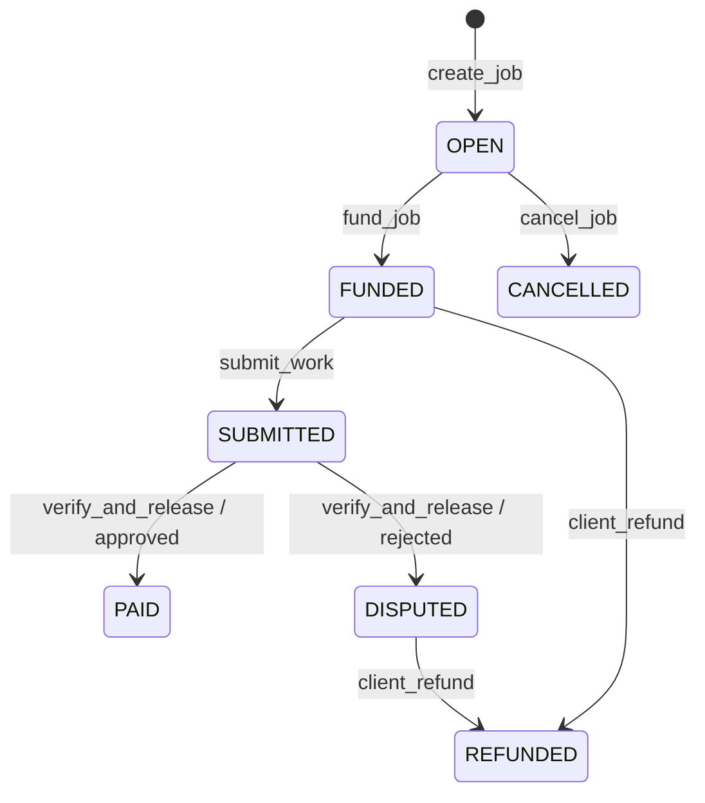

# Architecture

## System boundaries

FreelanceMarket is a Next.js 16 App Router application backed by one fixed GenLayer intelligent contract on Bradbury. Pages are role-aware but contract assertions remain the authorization boundary. Wallet writes originate in the browser; accepted-state reads pass through a POST-only server Route Handler.

```mermaid
flowchart LR
  U[Client or freelancer] --> P[Next.js App Router pages]
  P -->|wallet-signed allowlisted writes| W[genlayer-js client]
  W --> C[FreelanceMarket contract]
  P -->|POST allowlisted reads| A[/api/contract]
  A -->|accepted-state reads only| C
  C --> V[Bradbury validators and public evidence]
  C --> E[GEN escrow transfers]
```

## Routes and roles

| Route | Purpose | Role behavior |
| --- | --- | --- |
| `/` | Public overview and accepted contract statistics | Public |
| `/register` | Create one immutable wallet role and profile | Unregistered wallet |
| `/marketplace` | Browse registered freelancer profiles | Public; client hiring links |
| `/freelancer/[address]` | Public freelancer profile, published rate, links and on-chain work totals | Public; client hiring link |
| `/dashboard` | Profile editing and wallet-specific jobs | Client or freelancer |
| `/post-job` | Create a job for a registered freelancer | Registered client |
| `/job/[id]` | Job details and permitted lifecycle actions | Public read; client/freelancer writes |
| `/api/contract` | Validated contract reads | Server-side POST endpoint |

The frontend write helper allowlists `register`, `update_profile`, `create_job`, `fund_job`, `submit_work`, `verify_and_release`, `client_refund`, and `cancel_job`. The API read allowlist contains `get_profile`, `get_all_freelancers`, `get_job`, `get_jobs_by_client`, `get_jobs_by_freelancer`, and `get_stats`.

## Read security controls

`app/api/contract/route.ts` rejects unlisted methods, wrong argument counts, malformed addresses, and non-positive or oversized job identifiers. It always targets `CONTRACT_ADDRESS`, requests `stateStatus: "accepted"`, has no signing account, returns generic upstream errors, and disables response caching. This limits method/address selection; it is not authentication or rate limiting.

## Contract model

Wallets register once as `client` or `freelancer`; profile updates cannot change the role. Clients create, fund, verify, refund, and cancel where the current job status permits. Only the assigned freelancer can submit work.



There is no admin role or admin method. `PAID`, `REFUNDED`, and `CANCELLED` are terminal in the implemented interface.

## AI-assisted verification

The client initiates `verify_and_release`. The contract serializes title, description/requirements, deliverable URL, and any compatible submission description into explicit JSON before calling a module-level evaluator through `partial`. This avoids closing a nondeterministic function over contract storage, `self`, or an unserializable local record.

Each validator fetches bounded public content, treats page instructions as untrusted, asks an LLM for a bounded structured result, and fails closed on fetch, parsing, shape, or threshold errors. The comparative principle requires matching approval values, integer scores within 0–100 and ten points of each other, and a score of at least 70 for approval. Reasons may differ. This is semantic, validator-assisted judgment—not objective truth or legal arbitration.

## Synchronization and refresh

The transaction flow is detailed in [TRANSACTION_LIFECYCLE.md](TRANSACTION_LIFECYCLE.md). Important implementation properties are:

- structured receipt classification, with accepted/finalized plus `FINISHED_WITH_RETURN` required before state confirmation;
- `AbortSignal` propagation into accepted-state reads;
- a scope key/version guard that cancels stale results after wallet or route scope changes;
- retry of an existing hash without resubmitting a wallet write;
- polling deduplication through an in-flight guard;
- a global `freelance-market:refresh` event after expected state is observed;
- page polling and navigation/profile consumers that refresh dependent data without a browser reload.

## Deployment boundary

`lib/config.ts` contains the verified Bradbury fallback address, deployment transaction, chain ID, RPC, and explorer. `NEXT_PUBLIC_FREELANCE_MARKET_ADDRESS` can override the address at build time; because it is public and inlined by Next.js, a deployment must set it deliberately or omit it to use the verified fallback.
